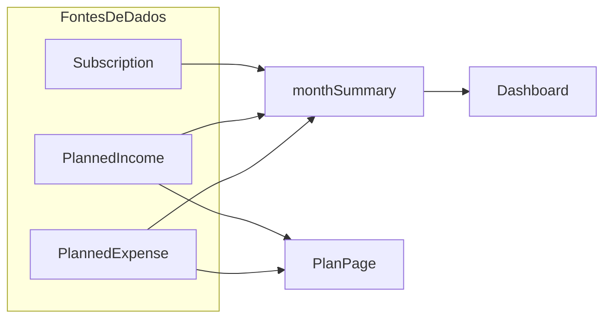
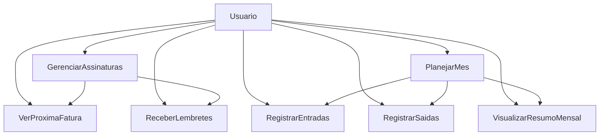

# Subscrip — Guia de Desenvolvimento

> **Última atualização:** Abril 2026
> **Status:** Em desenvolvimento ativo

---

## 1. Resumo do Projeto

O **Subscrip** é uma plataforma SaaS de gestão inteligente de finanças pessoais e empresariais, focada em resolver o problema do **"vazamento invisível de dinheiro"**: usuários que perdem o controle sobre múltiplas assinaturas ativas (Netflix, AWS, Vercel, academias, etc.) e acabam pagando por serviços que não utilizam ou sendo surpreendidos por renovações inesperadas. Além do controle de assinaturas, o produto evolui para um **planejamento financeiro mensal completo**, onde o usuário organiza entradas, saídas recorrentes e despesas variáveis para ter visão clara do saldo do mês.

### Valor Entregue

- **Centralização** de todas as assinaturas em um único painel
- **Planejamento mensal** com entradas, saídas e saldo previsto
- **Previsão exata** do gasto mensal e anual com assinaturas
- **Alertas** de próximas faturas (evitando surpresas no cartão)
- **Conversão automática de moedas** (ex: custo da AWS em BRL com base no dólar atual)

---

## 2. Funcionalidades do Produto

### 2.1 Perfil do Usuário

- **Avatar e dados pessoais** (nome, email)
- **Preferências:** moeda padrão, tema (dark/light), idioma
- **Configurações de notificação:** email e/ou push browser
- **Gerenciamento de conta:** alterar email, excluir conta

### 2.2 Dashboard (Página Inicial)

> Visão geral rápida das finanças do usuário.

- **Cards de resumo financeiros:**
  - Receitas planejadas do mês
  - Outras saídas planejadas (contas, cartões, saúde, impostos, etc.)
  - Assinaturas (estimativa mensal)
  - Total de saídas (outras saídas + assinaturas)
  - Saldo previsto do mês
- **Cards de assinaturas:**
  - Total de assinaturas ativas
  - Próxima fatura (data + nome + valor)
- **Gráfico de gastos por categoria** (pizza ou donut)
- **Lista das próximas 5 faturas** (ordenadas por data)
- **Acesso rápido:** botões "Nova Assinatura" e "Adicionar Item do Mês"

### 2.3 Base de Assinaturas Populares

> Banco de dados pré-cadastrado com as principais assinaturas do mercado para facilitar o cadastro.

#### Estrutura de cada assinatura na base:

| Campo | Descrição |
|---|---|
| `name` | Nome do serviço (ex: Netflix, Spotify, AWS) |
| `logo` | URL do logo oficial |
| `category` | Categoria padrão |
| `pricingUrl` | Link para página de preços oficial |
| `cancelUrl` | Link para página de cancelamento |
| `defaultCurrency` | Moeda padrão (BRL, USD, EUR) |
| `billingCycles` | Ciclos disponíveis (monthly, yearly) |

#### Assinaturas Pré-cadastradas (MVP)

**Entretenimento:**
| Serviço | Pricing | Cancelamento |
|---|---|---|
| Netflix | netflix.com/signup/planform | netflix.com/cancelplan |
| Spotify | spotify.com/premium | spotify.com/account |
| Amazon Prime | amazon.com.br/prime | amazon.com.br/prime/cancel |
| Disney+ | disneyplus.com/sign-up | disneyplus.com/account |
| HBO Max | max.com/plans | max.com/account |
| YouTube Premium | youtube.com/premium | youtube.com/paid_memberships |
| Apple TV+ | apple.com/br/apple-tv-plus | support.apple.com/subscriptions |
| Crunchyroll | crunchyroll.com/premium | crunchyroll.com/account |

**Infraestrutura/Dev:**
| Serviço | Pricing | Cancelamento |
|---|---|---|
| Vercel | vercel.com/pricing | vercel.com/account |
| AWS | aws.amazon.com/pricing | console.aws.amazon.com/billing |
| Google Cloud | cloud.google.com/pricing | console.cloud.google.com/billing |
| DigitalOcean | digitalocean.com/pricing | cloud.digitalocean.com/account |
| Heroku | heroku.com/pricing | dashboard.heroku.com/account |
| GitHub Pro | github.com/pricing | github.com/settings/billing |
| Cloudflare | cloudflare.com/plans | dash.cloudflare.com/profile |

**Ferramentas/Produtividade:**
| Serviço | Pricing | Cancelamento |
|---|---|---|
| Notion | notion.so/pricing | notion.so/settings |
| Figma | figma.com/pricing | figma.com/settings |
| Slack | slack.com/pricing | slack.com/account/settings |
| Zoom | zoom.us/pricing | zoom.us/account |
| Microsoft 365 | microsoft.com/microsoft-365 | account.microsoft.com/services |
| Google Workspace | workspace.google.com/pricing | admin.google.com/billing |
| 1Password | 1password.com/sign-up | my.1password.com/settings |
| Canva Pro | canva.com/pricing | canva.com/settings/billing |

**Educação:**
| Serviço | Pricing | Cancelamento |
|---|---|---|
| Coursera Plus | coursera.org/courseraplus | coursera.org/account-settings |
| Udemy | udemy.com/pricing | udemy.com/user/edit-account |
| Alura | alura.com.br/planos | alura.com.br/minha-conta |
| Duolingo Plus | duolingo.com/plus | duolingo.com/settings/subscription |
| Skillshare | skillshare.com/pricing | skillshare.com/settings |

**Saúde/Fitness:**
| Serviço | Pricing | Cancelamento |
|---|---|---|
| Gympass/Wellhub | gympass.com/plans | gympass.com/account |
| Strava | strava.com/subscribe | strava.com/settings/subscription |
| Headspace | headspace.com/subscriptions | headspace.com/account |
| Calm | calm.com/subscribe | calm.com/account |

### 2.4 Página de Assinaturas por Categoria

> Visualização organizada de todas as assinaturas do usuário.

- **Agrupamento por categoria:**
  - Entretenimento
  - Infraestrutura
  - Ferramentas
  - Educação
  - Saúde/Fitness
  - Outros (categoria customizável)

- **Para cada assinatura exibir:**
  - Logo do serviço (da base ou upload)
  - Nome
  - Preço + moeda
  - Ciclo de cobrança (mensal/anual)
  - Próxima data de cobrança
  - Status (ativa/pausada/cancelada)
  - Link rápido para pricing e cancelamento

- **Ações disponíveis:**
  - Editar assinatura
  - Pausar/Reativar
  - Cancelar (com confirmação)
  - Configurar lembrete

- **Filtros e ordenação:**
  - Por categoria
  - Por status (ativa/pausada/cancelada)
  - Por preço (maior/menor)
  - Por data de vencimento (próxima/mais distante)
  - Busca por nome

### 2.5 Sistema de Lembretes

> Notificações para evitar surpresas com cobranças.

#### Tipos de lembrete:

| Tipo | Descrição |
|---|---|
| **Email** | Enviado via Resend X dias antes do vencimento |
| **Push Browser** | Notificação via Web Push API (Service Worker) |

#### Configurações por assinatura:

- **Ativar/desativar** lembrete
- **Antecedência:** 1, 3, 7 ou 14 dias antes
- **Canal:** email, push ou ambos
- **Horário preferido:** manhã (9h), tarde (14h), noite (19h)

#### Configurações globais (perfil):

- **Lembrete padrão** para novas assinaturas (ex: 3 dias antes, email)
- **Desativar todos os lembretes** (modo silêncioso)
- **Resumo semanal** por email (dom/seg) com próximas cobranças

### 2.6 Planejamento Financeiro Mensal

> Organização mensal completa de entradas e saídas para prever saldo e tomada de decisão.

- **Escopo por mês** (ano + mês), por usuário
- **Entradas (A Receber):**
  - Nome da entrada (ex: salário, freelas, comissão)
  - Valor
  - Moeda
- **Saídas planejadas:**
  - Nome do custo (ex: aluguel, cartão, plano de saúde, DAS, parcela)
  - Valor
  - Moeda
  - Bucket (categoria financeira de planejamento)
- **Buckets padrão para resumo mensal:**
  - `MONTHLY_BILLS` (contas do mês)
  - `CREDIT_CARD` (fatura de cartão)
  - `FIXED_CARD` (cartões fixos/parcelas fixas)
  - `OTHER` (demais custos)
- **Totais calculados automaticamente:**
  - Total a receber
  - Total de saídas planejadas
  - Assinaturas estimadas no mês
  - Total de saídas consolidadas
  - Saldo do mês
- **Regra de produto para evitar duplicação:**
  - Assinaturas permanecem como fonte oficial de cobrança/lembrete
  - Planejamento mensal armazena linhas manuais de orçamento

---

## 3. Design System

### 3.1 Paleta de Cores (Verde)

> O verde transmite **controle financeiro**, **crescimento** e **segurança** — ideal para um app de gestão de dinheiro.

#### Light Mode

| Token | Cor | Uso |
|---|---|---|
| `--primary` | `#10B981` (Emerald 500) | Botões, links, destaques |
| `--primary-foreground` | `#FFFFFF` | Texto sobre primary |
| `--primary-hover` | `#059669` (Emerald 600) | Hover em botões |
| `--primary-light` | `#D1FAE5` (Emerald 100) | Backgrounds sutis, badges |
| `--background` | `#FFFFFF` | Fundo principal |
| `--foreground` | `#111827` (Gray 900) | Texto principal |
| `--muted` | `#F3F4F6` (Gray 100) | Fundos secundários |
| `--muted-foreground` | `#6B7280` (Gray 500) | Texto secundário |
| `--border` | `#E5E7EB` (Gray 200) | Bordas |
| `--destructive` | `#EF4444` (Red 500) | Erros, cancelar |
| `--warning` | `#F59E0B` (Amber 500) | Alertas, vencimento próximo |
| `--success` | `#10B981` (Emerald 500) | Sucesso, ativo |

#### Dark Mode

| Token | Cor | Uso |
|---|---|---|
| `--primary` | `#34D399` (Emerald 400) | Botões, links, destaques |
| `--primary-foreground` | `#111827` | Texto sobre primary |
| `--primary-hover` | `#6EE7B7` (Emerald 300) | Hover em botões |
| `--primary-light` | `#064E3B` (Emerald 900) | Backgrounds sutis |
| `--background` | `#111827` (Gray 900) | Fundo principal |
| `--foreground` | `#F9FAFB` (Gray 50) | Texto principal |
| `--muted` | `#1F2937` (Gray 800) | Fundos secundários |
| `--muted-foreground` | `#9CA3AF` (Gray 400) | Texto secundário |
| `--border` | `#374151` (Gray 700) | Bordas |
| `--destructive` | `#F87171` (Red 400) | Erros, cancelar |
| `--warning` | `#FBBF24` (Amber 400) | Alertas |
| `--success` | `#34D399` (Emerald 400) | Sucesso |

#### CSS Variables (globals.css)

```css
:root {
  --primary: 160 84% 39%;           /* Emerald 500 */
  --primary-foreground: 0 0% 100%;
  --background: 0 0% 100%;
  --foreground: 220 13% 13%;
  --muted: 220 14% 96%;
  --muted-foreground: 220 9% 46%;
  --border: 220 13% 91%;
  --destructive: 0 84% 60%;
  --warning: 38 92% 50%;
  --success: 160 84% 39%;
}

.dark {
  --primary: 160 72% 52%;           /* Emerald 400 */
  --primary-foreground: 220 13% 13%;
  --background: 220 13% 13%;
  --foreground: 220 14% 98%;
  --muted: 220 13% 18%;
  --muted-foreground: 220 9% 65%;
  --border: 220 13% 26%;
  --destructive: 0 91% 71%;
  --warning: 45 93% 58%;
  --success: 160 72% 52%;
}
```

### 3.2 Responsividade (Mobile-First)

> **Prioridade máxima:** a experiência mobile deve ser tão boa quanto desktop.

#### Breakpoints (Tailwind)

| Breakpoint | Largura | Dispositivo |
|---|---|---|
| `sm` | 640px | Celulares grandes |
| `md` | 768px | Tablets |
| `lg` | 1024px | Laptops |
| `xl` | 1280px | Desktops |

#### Adaptações Mobile:

- **Sidebar:** colapsa em menu hamburger (Sheet do Shadcn)
- **Cards de métricas:** empilham verticalmente (1 coluna)
- **Tabelas:** viram cards empilhados ou scroll horizontal
- **Botões:** full-width em mobile
- **Modals:** ocupam tela inteira (Sheet bottom)
- **Touch targets:** mínimo 44x44px
- **Fontes:** escala proporcional (clamp())

#### Checklist de Responsividade:

- [ ] Landing page 100% responsiva
- [ ] Dashboard adapta cards em grid flexível
- [ ] Sidebar vira drawer em mobile
- [ ] Formulários com inputs full-width
- [ ] Tabelas com scroll horizontal ou card view
- [ ] Modals como bottom sheets em mobile
- [ ] Testar em 375px (iPhone SE), 390px (iPhone 14), 768px (iPad)

### 3.3 Dark/Light Mode

> **Prioridade máxima:** suporte nativo desde o início.

#### Implementação:

- **next-themes** para persistência e SSR
- **Classe `.dark`** no `<html>` (Tailwind dark mode)
- **Toggle** no header do dashboard
- **Respeitar `prefers-color-scheme`** do sistema como padrão
- **Persistência** em localStorage + cookie (evitar flash)

#### Checklist Dark Mode:

- [ ] Instalar e configurar `next-themes`
- [ ] Atualizar `globals.css` com variáveis dark
- [ ] Criar componente `ThemeToggle` (sol/lua)
- [ ] Testar todos os componentes em ambos os temas
- [ ] Garantir contraste WCAG AA (4.5:1 para texto)
- [ ] Logos/ícones com versões para cada tema (se necessário)

---

## 4. Stack Tecnológica

> Adicionado `next-themes` para dark/light mode.

### Frontend

| Tecnologia | Função |
|---|---|
| **Next.js 16** (App Router) | Framework core com foco em Server Components |
| **TypeScript** | Tipagem estática |
| **React 19** | Biblioteca de UI |
| **Tailwind CSS 4** | Estilização utilitária |
| **Shadcn UI** (New York style) | Componentes acessíveis baseados no Radix UI |
| **Lucide React** | Ícones |
| **GSAP** | Animações da landing page e da plataforma |
| **next-themes** | Dark/Light mode com persistência |

### Estado e Formulários

| Tecnologia | Função |
|---|---|
| **Redux Toolkit** | Estado global (Wizard de criação de assinatura, etc.) |
| **React Hook Form + Zod** | Validação e gerenciamento de formulários |

### Backend (BFF — Backend for Frontend)

| Tecnologia | Função |
|---|---|
| **Next.js Server Actions** | Lógica de servidor sem endpoints REST tradicionais |
| **Better Auth** | Autenticação com OTP (substitui NextAuth) |
| **Resend** | Envio transacional de emails (OTP, notificações) |

### Infraestrutura de Dados

| Tecnologia | Função |
|---|---|
| **Prisma 5** | ORM com tipagem ponta a ponta e migrations |
| **PostgreSQL** (Neon) | Banco de dados serverless com connection pooling nativo |

### Deploy

| Tecnologia | Função |
|---|---|
| **Vercel** | Hospedagem (Edge Functions, Serverless, CDN) |
| **Neon** | PostgreSQL serverless (integração nativa Vercel Marketplace) |
| **Resend** | Serviço de email transacional (SDK Next.js + React Email) |

---

## 5. Estrutura do Projeto (Atual)

```
subscrip/
├── prisma/
│   ├── migrations/           # Migrations do banco
│   ├── schema.prisma         # Schema do banco de dados
│   └── seed.ts               # Dados de seed para dev
├── public/                   # Assets estáticos
├── src/
│   ├── app/
│   │   ├── api/auth/[...nextauth]/route.ts  # Handler NextAuth (será substituído por Better Auth)
│   │   ├── auth/
│   │   │   ├── login/page.tsx               # Página de login (Magic Link)
│   │   │   ├── login/verify/page.tsx        # Página "verifique seu email"
│   │   │   └── register/page.tsx            # Página de registro
│   │   ├── dashboard/page.tsx               # Dashboard principal
│   │   ├── register/                        # (vazio)
│   │   ├── globals.css                      # CSS global + design tokens
│   │   ├── layout.tsx                       # Root layout
│   │   └── page.tsx                         # Landing page
│   ├── auth.config.ts        # Configuração de rotas/callbacks de auth (Edge)
│   ├── auth.ts               # Setup NextAuth + Nodemailer provider
│   ├── components/
│   │   ├── shared/           # (vazio — componentes compartilhados futuros)
│   │   └── ui/               # Componentes Shadcn (button, card, dialog, form, input, label)
│   ├── hooks/                # (vazio — hooks customizados futuros)
│   ├── lib/
│   │   ├── prisma.ts         # Singleton do PrismaClient
│   │   ├── store/            # (vazio — Redux store futuro)
│   │   └── utils/
│   │       ├── formatters.ts # formatCurrency()
│   │       └── helpers.ts    # cn() (class merge)
│   ├── middleware.ts          # Middleware de proteção de rotas
│   └── server/
│       └── actions/
│           └── auth.ts       # Server Actions: login() e register()
├── .env.example              # Template de variáveis de ambiente
├── components.json           # Configuração Shadcn UI
├── next.config.ts            # Config Next.js (React Compiler ativo)
├── package.json
└── tsconfig.json
```

---

## 6. Modelo de Dados (Prisma Schema)

```prisma
enum Currency    { BRL, USD, EUR }
enum BillingCycle { MONTHLY, YEARLY, WEEKLY }
enum Category    { INFRASTRUCTURE, ENTERTAINMENT, EDUCATION, TOOLS, FITNESS, OTHER }
enum ReminderChannel { EMAIL, PUSH, BOTH }
enum ExpenseBucket { MONTHLY_BILLS, CREDIT_CARD, FIXED_CARD, OTHER }

model User {
  id, name?, email (unique), emailVerified?, image?
  preferredCurrency, theme (dark/light/system)
  defaultReminderDays, defaultReminderChannel
  → accounts[], sessions[], subscriptions[], reminders[], monthlyPlans[]
}

model Account   { userId, type, provider, providerAccountId, tokens... }
model Session   { sessionToken (unique), userId, expires }
model VerificationToken { identifier, token, expires }

model Subscription {
  id, name, price (Decimal 10,2), currency, billingCycle, category
  startDate, nextBillingDate, active (default true)
  serviceTemplateId? → ServiceTemplate (opcional, se veio da base)
  userId → User
  → reminders[]
  @@index([userId]), @@index([nextBillingDate])
}

// Base de assinaturas populares (pré-cadastradas)
model ServiceTemplate {
  id, name, slug (unique)
  logoUrl, category, defaultCurrency
  pricingUrl, cancelUrl
  billingCycles[] (MONTHLY, YEARLY, etc.)
  → subscriptions[] (assinaturas criadas a partir deste template)
}

model Reminder {
  id, subscriptionId → Subscription
  userId → User
  daysBefore (1, 3, 7, 14)
  channel (EMAIL, PUSH, BOTH)
  preferredTime (morning, afternoon, evening)
  enabled (default true)
  lastSentAt?
  @@index([subscriptionId])
}

model MonthlyPlan {
  id, year, month, notes?
  userId → User
  → incomes[], expenses[]
  @@unique([userId, year, month])
  @@index([userId, year, month])
}

model PlannedIncome {
  id, name
  amount (Decimal 10,2), currency
  sortOrder
  monthlyPlanId → MonthlyPlan
  @@index([monthlyPlanId])
}

model PlannedExpense {
  id, name
  amount (Decimal 10,2), currency
  expenseBucket (MONTHLY_BILLS, CREDIT_CARD, FIXED_CARD, OTHER)
  sortOrder
  monthlyPlanId → MonthlyPlan
  @@index([monthlyPlanId])
}
```

### Fluxo de Agregação Financeira



### Diagrama de Caso de Uso



---

## 7. Variáveis de Ambiente

```env
# Neon PostgreSQL (via Vercel Marketplace)
DATABASE_URL=              # Connection pooling (pooled connection string)
DIRECT_URL=                # Conexão direta (migrations)

# Ambiente
NODE_ENV=

# Resend (email)
RESEND_API_KEY=            # API key do Resend (re_xxxxxxxx)
EMAIL_FROM=                # Ex: Subscrip <noreply@subscrip.com>

# Auth
BETTER_AUTH_SECRET=        # Secret para Better Auth
BETTER_AUTH_URL=           # URL base da aplicação (ex: http://localhost:3000)
```

---

## 8. Roadmap de Desenvolvimento — Etapas e Períodos

Cada etapa contém suas tarefas com status de conclusão. O checkbox `[x]` indica o que já foi feito e `[ ]` indica o que falta.

---

### FASE 1 — Fundação e Setup (Semana 1)

> **Objetivo:** Inicializar o projeto, configurar a stack base e o banco de dados.

#### 1A — Setup Inicial

- [x] Inicializar projeto Next.js 16 com TypeScript e App Router
- [x] Configurar Tailwind CSS 4 e variáveis de design tokens (`globals.css`)
- [x] Configurar Shadcn UI (estilo New York, Lucide icons)
- [x] Configurar `next.config.ts` com React Compiler
- [x] Criar utilitários base: `cn()`, `formatCurrency()`

#### 1B — Banco de Dados e Prisma

- [x] Instalar e configurar Prisma com PostgreSQL
- [x] Criar `docker-compose.yml` para PostgreSQL 16 local (desenvolvimento)
- [x] Criar schema do banco: `User`, `Account`, `Session`, `VerificationToken`, `Subscription`
- [x] Criar novos models: `ServiceTemplate` (base de assinaturas populares), `Reminder` (lembretes)
- [x] Criar enums: `Currency`, `BillingCycle`, `Category` (+ `FITNESS`, `OTHER`), `ReminderChannel`, `Theme`
- [x] Adicionar campos de preferências no `User`: `theme`, `preferredCurrency`, `defaultReminderDays`, `defaultReminderChannel`
- [x] Configurar singleton do PrismaClient (`lib/prisma.ts`)

#### 1C — Seed e Ambiente

- [x] Criar seed completo com:
  - Usuário de teste (`test@subscrip.dev`)
  - 24 service templates (Netflix, Spotify, AWS, Vercel, Notion, etc.)
  - 5 assinaturas de exemplo vinculadas ao usuário
- [x] Criar `.env.example` com configuração Docker local e Neon (produção)
- [x] Adicionar scripts no `package.json`: `docker:up`, `docker:down`, `db:studio`, `setup`

**Status: ✅ COMPLETA**

---

### FASE 2 — Autenticação Passwordless (Semana 2)

> **Objetivo:** Implementar o fluxo completo de autenticação sem senha.

#### 2A — Implementação Atual (NextAuth — será substituída)

- [x] Instalar e configurar NextAuth v5 com PrismaAdapter
- [x] Configurar provider Nodemailer (Magic Links via AWS SES)
- [x] Criar `auth.config.ts` com Split Configuration (Edge Runtime)
- [x] Configurar Middleware de proteção de rotas (`middleware.ts`)
- [x] Criar Server Actions: `login()` e `register()` com validação de existência de usuário
- [x] Criar página de Login (`/auth/login`) com formulário de email
- [x] Criar página de Registro (`/auth/register`) com nome + email
- [x] Criar página de verificação (`/auth/login/verify`) — "verifique seu email"
- [x] Configurar catch-all route NextAuth (`/api/auth/[...nextauth]`)
- [x] Implementar lógica de redirecionamento (usuário logado → dashboard, não logado → login)
- [x] Tratar erro de "usuário não encontrado" no login

#### 2B — Migração para Better Auth com OTP (Semana 2–3)

- [x] Instalar `better-auth` e `@better-auth/prisma-adapter`
- [x] Remover `next-auth`, `@auth/prisma-adapter` do projeto
- [x] Configurar Better Auth (`lib/auth.ts`) com adapter Prisma
- [x] Configurar plugin de **Email OTP** no Better Auth
- [x] Atualizar schema Prisma para o modelo de dados do Better Auth (`Account`, `Session`, `Verification`)
- [x] Criar novo endpoint de API para Better Auth (`/api/auth/[...all]/route.ts`)
- [x] Criar cliente Better Auth (`lib/auth-client.ts`) para uso no frontend
- [x] Refatorar Server Actions (`getSession`, `signOut`)
- [x] Refatorar Middleware de proteção de rotas para Better Auth (`getSessionCookie`)
- [x] Atualizar página de Login: trocar Magic Link por input de **código OTP**
- [x] Criar componente de input OTP (6 dígitos) com auto-focus entre campos (`components/ui/input-otp.tsx`)
- [x] Atualizar página de Registro para fluxo OTP
- [x] Remover página de verificação antiga (`/auth/login/verify`)
- [x] Configurar envio de OTP via Resend (com fallback para console em dev)
- [x] Atualizar Dashboard para usar Better Auth session e filtrar por `userId`
- [x] Testar fluxo completo: registro → OTP → dashboard → logout → login → OTP → dashboard

**Status: ✅ COMPLETA (pendente teste manual)**

---

### FASE 3 — Landing Page com GSAP (Semana 3)

> **Objetivo:** Transformar a landing page básica em uma experiência visual impactante com animações GSAP.

- [x] Criar estrutura base da landing page (header, hero, CTA)
- [ ] Instalar `gsap` e o plugin `@gsap/react` (useGSAP hook)
- [ ] Criar componente `LandingPage` como Client Component (`'use client'`)
- [ ] **Hero Section:** animação de fade-in + slide-up no título e subtítulo com `gsap.from()` e stagger
- [ ] **Header:** animação de entrada suave do navbar
- [ ] **CTA Button:** animação de pulse/glow sutil no botão principal
- [ ] **Seção de Features:** criar seção com 3-4 cards de funcionalidades
  - [ ] Animação de scroll-trigger nos cards (aparecem ao scrollar)
  - [ ] Cards: "Painel Unificado", "Alertas Inteligentes", "Conversão de Moedas", "Previsão de Gastos"
- [ ] **Seção de como funciona:** 3 passos visuais com animações sequenciais
- [ ] **Seção de pricing/planos** (se aplicável) com animação de entrada
- [ ] **Footer:** informações institucionais e links
- [ ] Garantir responsividade completa (mobile-first)
- [ ] Otimizar performance: registrar plugins GSAP apenas no client, cleanup no unmount

**Status: 🔴 PENDENTE**

---

### FASE 4 — Dashboard Completo (Semana 4–5)

> **Objetivo:** Transformar o dashboard básico em uma visão consolidada de assinaturas + planejamento financeiro mensal.

#### 4A — Layout e Navegação

- [ ] Criar layout do dashboard com **sidebar** (Shadcn Sidebar ou custom)
- [ ] Implementar navegação: Dashboard, Assinaturas, Configurações
- [ ] Criar componente de **Header do Dashboard** com avatar, nome e logout
- [ ] Implementar tema dark/light toggle
- [ ] Animações GSAP de transição entre páginas/seções

#### 4B — Cards de Métricas (Refatoração)

- [x] Card: Gasto Mensal Estimado (com conversão básica USD→BRL)
- [x] Card: Assinaturas Ativas (contagem)
- [x] Card: Próxima Fatura (data + nome)
- [ ] Card: Receitas planejadas do mês
- [ ] Card: Outras saídas planejadas do mês
- [ ] Card: Total de saídas consolidadas (planejamento + assinaturas)
- [ ] Card: Saldo previsto do mês
- [ ] Card: Gasto Anual Estimado
- [ ] Animação GSAP nos números (counter animation ao carregar)
- [ ] Conversão de moedas com taxa real (API de câmbio ou config manual)

#### 4C — Lista de Assinaturas (Refatoração)

- [x] Listagem básica de assinaturas com nome, categoria, ciclo, preço e vencimento
- [ ] Adicionar badge de status (ativa/pausada/cancelada)
- [ ] Adicionar ícone/logo de cada serviço
- [ ] Implementar filtros por categoria e status
- [ ] Implementar ordenação (preço, vencimento, nome)
- [ ] Implementar busca por nome
- [ ] Adicionar ações: editar, pausar, cancelar
- [ ] Animação GSAP de entrada na lista (stagger nos items)

#### 4D — Filtrar por Usuário (Segurança Multi-tenant)

- [ ] Refatorar queries do dashboard para filtrar por `userId` da sessão autenticada
- [ ] Garantir isolamento total de dados entre usuários
- [ ] Seed vinculado a um usuário de teste
- [ ] Garantir isolamento por `userId` também em `MonthlyPlan`, `PlannedIncome` e `PlannedExpense`

**Status: 🟡 PARCIALMENTE IMPLEMENTADA**

---

### FASE 4.5 — Planejamento Financeiro Mensal (Semana 5)

> **Objetivo:** Implementar a camada de planejamento do mês com entradas, saídas e saldo previsto.

#### 4.5A — Modelagem e Persistência

- [ ] Adicionar model `MonthlyPlan` com chave única por `userId + year + month`
- [ ] Adicionar model `PlannedIncome` para entradas mensais
- [ ] Adicionar model `PlannedExpense` com enum `ExpenseBucket`
- [ ] Criar índices para leitura eficiente por mês/usuário
- [ ] Atualizar seed com plano mensal de exemplo para usuário de teste

#### 4.5B — Backend (Server Actions + Validação)

- [ ] Criar função `getOrCreateMonthlyPlan(userId, year, month)`
- [ ] Criar Server Actions para CRUD de `PlannedIncome`
- [ ] Criar Server Actions para CRUD de `PlannedExpense`
- [ ] Validar payloads com Zod (nome, valor, moeda, bucket)
- [ ] Implementar agregador `monthSummary` no servidor

#### 4.5C — Interface de Planejamento

- [ ] Criar rota `/plan` (ou `/dashboard/plan`) com seletor de mês/ano
- [ ] Exibir colunas de entradas e saídas em formato de planejamento mensal
- [ ] Exibir resumo: receber total, custos totais, assinaturas, saldo
- [ ] Garantir experiência mobile-first para edição rápida

**Status: 🔴 PENDENTE**

---

### FASE 5 — CRUD de Assinaturas (Semana 5–6)

> **Objetivo:** Implementar o fluxo completo de criação, edição e exclusão de assinaturas.

#### 5A — Wizard de Criação (Redux Toolkit)

- [ ] Configurar Redux Store (`lib/store/`)
- [ ] Criar slice de "Subscription Wizard" com steps:
  - **Step 1:** Nome e categoria do serviço
  - **Step 2:** Preço, moeda e ciclo de cobrança
  - **Step 3:** Data de início e próximo vencimento
  - **Step 4:** Revisão e confirmação
- [ ] Criar Provider do Redux no layout do dashboard
- [ ] Criar componente de Wizard com progress bar
- [ ] Implementar navegação entre steps (voltar/avançar)
- [ ] Validação com Zod em cada step
- [ ] Server Action para persistir assinatura no banco
- [ ] Animações GSAP de transição entre steps do wizard

#### 5B — Modal/Dialog de Criação Rápida

- [ ] Criar Dialog (Shadcn) para criação rápida em formulário único
- [ ] Vinculado ao botão "Nova Assinatura" no dashboard

#### 5C — Edição e Exclusão

- [ ] Criar página/modal de edição de assinatura
- [ ] Server Action para update de assinatura
- [ ] Server Action para soft-delete (marcar `active: false`) ou hard-delete
- [ ] Confirmação antes de excluir (Dialog de confirmação)

**Status: 🔴 PENDENTE**

---

### FASE 6 — Alertas e Notificações (Semana 6–7)

> **Objetivo:** Notificar o usuário sobre faturas próximas e renovações.

- [ ] Definir modelo de notificação no Prisma (ou usar campo `notifiedAt` na Subscription)
- [ ] Criar lógica de verificação de faturas próximas (cron job ou Vercel Cron)
- [ ] Enviar email de alerta X dias antes do vencimento (Resend)
- [ ] Criar página/seção de notificações no dashboard
- [ ] Criar componente de badge de notificações no header
- [ ] Toast de notificação in-app (Shadcn Toast/Sonner)

**Status: 🔴 PENDENTE**

---

### FASE 7 — Conversão de Moedas (Semana 7)

> **Objetivo:** Converter automaticamente valores em moeda estrangeira para BRL.

- [x] Conversão básica hardcoded (USD 1 = R$ 6)
- [ ] Integrar API de câmbio (ex: AwesomeAPI, Open Exchange Rates)
- [ ] Cachear taxa de câmbio (revalidar a cada X horas)
- [ ] Exibir taxa de câmbio utilizada no dashboard
- [ ] Permitir que o usuário configure taxa manual como alternativa
- [ ] Suportar EUR e outras moedas futuras

**Status: 🟡 BÁSICO IMPLEMENTADO**

---

### FASE 8 — Animações GSAP na Plataforma (Semana 7–8)

> **Objetivo:** Enriquecer a experiência do usuário dentro da plataforma com micro-interações GSAP.

- [ ] Animação de entrada do sidebar (slide-in)
- [ ] Animação de entrada dos cards de métricas (fade + scale com stagger)
- [ ] Animação de counter nos valores numéricos (0 → valor final)
- [ ] Animação de entrada da lista de assinaturas (stagger nos rows)
- [ ] Animação de transição ao abrir/fechar modals
- [ ] Animação de transição entre steps do Wizard
- [ ] Animação de hover nos cards interativos
- [ ] Animação de feedback visual ao criar/editar/excluir assinatura
- [ ] Garantir que animações respeitam `prefers-reduced-motion`
- [ ] Cleanup correto de animações com `useGSAP()` hook

**Status: 🔴 PENDENTE**

---

### FASE 9 — Configurações e Perfil (Semana 8)

> **Objetivo:** Permitir que o usuário gerencie seus dados e preferências.

- [ ] Criar página `/dashboard/settings`
- [ ] Seção de perfil: editar nome e email
- [ ] Seção de preferências: moeda padrão, tema (dark/light)
- [ ] Seção de conta: excluir conta (com confirmação)
- [ ] Server Actions para atualização de perfil
- [ ] Logout funcional com redirecionamento

**Status: 🔴 PENDENTE**

---

### FASE 10 — Gráficos e Analytics (Semana 9)

> **Objetivo:** Visualizações que ajudem o usuário a entender seus gastos.

- [ ] Instalar biblioteca de gráficos (Recharts ou similar compatível com SSR)
- [ ] Gráfico de pizza: gastos por categoria (incluindo buckets do planejamento mensal)
- [ ] Gráfico de linha: evolução mensal de receitas vs saídas
- [ ] Gráfico de barras: comparação entre assinaturas
- [ ] Integrar gráficos no dashboard como seção
- [ ] Animação GSAP de entrada nos gráficos

**Status: 🔴 PENDENTE**

---

### FASE 11 — Testes e Qualidade (Semana 9–10)

> **Objetivo:** Garantir estabilidade e confiabilidade do projeto.

- [ ] Configurar Vitest (ou Jest) para testes unitários
- [ ] Testes unitários para Server Actions (auth, subscriptions)
- [ ] Testes unitários para utilitários (`formatCurrency`, `cn`)
- [ ] Configurar Playwright para testes E2E
- [ ] Testes E2E: fluxo de registro → login → dashboard
- [ ] Testes E2E: CRUD de assinaturas
- [ ] Configurar CI com GitHub Actions (lint + type-check + testes)

**Status: 🔴 PENDENTE**

---

### FASE 12 — Deploy e Produção (Semana 10)

> **Objetivo:** Colocar o projeto em produção.

- [ ] Configurar projeto na Vercel
- [ ] Configurar variáveis de ambiente na Vercel
- [ ] Configurar domínio customizado (se aplicável)
- [ ] Configurar Resend em produção (verificar domínio)
- [ ] Executar migration em produção
- [ ] Testar fluxo completo em produção
- [ ] Configurar monitoramento básico (Vercel Analytics)
- [ ] Criar README.md final com instruções de setup

**Status: 🔴 PENDENTE**

---

## 9. Como Iniciar o Desenvolvimento

### Pré-requisitos

- **Node.js** 20+
- **pnpm** (gerenciador de pacotes)
- Conta no **Neon** (banco PostgreSQL) — disponível no Vercel Marketplace
- Conta no **Resend** (para envio de emails) — free tier: 100 emails/dia

### Setup Local

```bash
# 1. Clonar o repositório
git clone <repo-url>
cd subscrip

# 2. Instalar dependências
pnpm install

# 3. Configurar variáveis de ambiente
cp .env.example .env
# Preencher .env com suas credenciais

# 4. Gerar client Prisma
pnpm db:generate

# 5. Aplicar migrations no banco
pnpm db:push

# 6. Popular banco com dados de teste
pnpm db:seed

# 7. Iniciar servidor de desenvolvimento
pnpm dev
```

### Próximos Passos Imediatos

1. **Aplicar paleta de cores verde** e configurar dark/light mode (`next-themes`)
2. **Migrar autenticação** de NextAuth para Better Auth com OTP (Fase 2B)
3. **Criar base de assinaturas populares** no banco (model `ServiceTemplate`)
4. **Implementar camada de planejamento mensal** (`MonthlyPlan`, `PlannedIncome`, `PlannedExpense`)
5. **Refatorar dashboard** para consolidar entradas, saídas, assinaturas e saldo

---

## 10. Decisões Arquiteturais Importantes

### Better Auth > NextAuth

A migração para **Better Auth** traz:
- **OTP nativo** (código de 6 dígitos ao invés de Magic Link) — menor atrito
- API mais simples e moderna
- Melhor compatibilidade com Edge Runtime
- Plugins extensíveis (2FA, OAuth, etc.)

### GSAP para Animações

O **GSAP** foi escolhido por:
- Performance superior a CSS animations para animações complexas
- `ScrollTrigger` para animações baseadas em scroll (landing page)
- `useGSAP()` hook oficial para React (cleanup automático)
- Timeline API para sequências de animação coordenadas
- Ampla comunidade e documentação

### Neon > Supabase

O **Neon** foi escolhido por:
- **Serverless nativo** — escala automaticamente, ideal para Vercel Functions
- **Integração Vercel Marketplace** — variáveis de ambiente injetadas automaticamente
- **Branching** — cria branches do banco para dev/staging (como Git para o banco)
- **Free tier generoso** — suficiente para desenvolvimento e início de produção
- **Connection pooling nativo** — sem necessidade de configurar PgBouncer manualmente

### Resend > AWS SES

O **Resend** foi escolhido por:
- **SDK Next.js nativo** — integração direta com Server Actions
- **React Email** — templates de email escritos como componentes React
- **API simples** — `resend.emails.send({ from, to, subject, react: <Component /> })`
- **Free tier** — 100 emails/dia (suficiente para dev e início)
- **Sem sandbox** — não precisa verificar cada email de destino como no SES
- **Criado para o ecossistema Vercel/Next.js**

### Split Configuration (Edge vs Serverless)

- **Edge Runtime (Middleware):** apenas lógica de roteamento — rápido e barato
- **Serverless (Server Actions):** lógica pesada como Resend, Prisma — sem limitação de pacotes

### Multi-tenant por userId

Toda query de dados (assinaturas e planejamento mensal) **deve** ser filtrada por `userId` da sessão, garantindo isolamento total de dados entre usuários.

---

## 11. Comandos Úteis

| Comando | Descrição |
|---|---|
| `pnpm dev` | Iniciar servidor de desenvolvimento |
| `pnpm build` | Build de produção |
| `pnpm lint` | Verificar linting |
| `pnpm db:generate` | Gerar Prisma Client |
| `pnpm db:push` | Sincronizar schema com o banco |
| `pnpm db:seed` | Popular banco com dados de teste |

---

## 12. Resumo de Progresso

| Fase | Descrição | Status |
|---|---|---|
| **Fase 1** | Fundação e Setup | ✅ Completa |
| **Fase 2A** | Auth NextAuth (Magic Link) | ✅ Completa |
| **Fase 2B** | Migração para Better Auth (OTP) | 🔴 Pendente |
| **Fase 3** | Landing Page com GSAP | 🔴 Pendente |
| **Fase 4** | Dashboard Completo | 🟡 Parcial |
| **Fase 4.5** | Planejamento Financeiro Mensal | 🔴 Pendente |
| **Fase 5** | CRUD de Assinaturas | 🔴 Pendente |
| **Fase 6** | Alertas e Notificações | 🔴 Pendente |
| **Fase 7** | Conversão de Moedas | 🟡 Básico |
| **Fase 8** | Animações GSAP na Plataforma | 🔴 Pendente |
| **Fase 9** | Configurações e Perfil | 🔴 Pendente |
| **Fase 10** | Gráficos e Analytics | 🔴 Pendente |
| **Fase 11** | Testes e Qualidade | 🔴 Pendente |
| **Fase 12** | Deploy e Produção | 🔴 Pendente |
