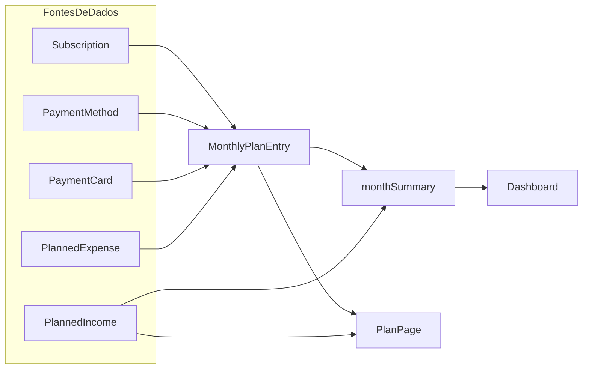
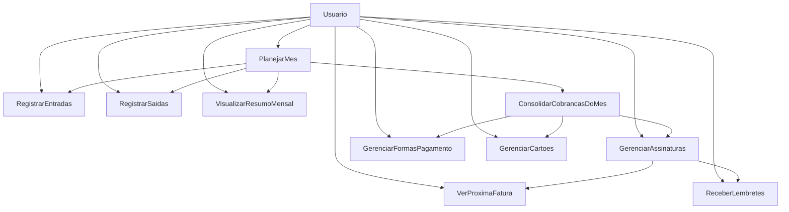

# Subscrip — Schema e Diagramas

## Modelo de Dados (Visao)

```prisma
enum Currency { BRL, USD, EUR }
enum BillingCycle { MONTHLY, YEARLY, WEEKLY }
enum Category { INFRASTRUCTURE, ENTERTAINMENT, EDUCATION, TOOLS, FITNESS, OTHER }
enum ReminderChannel { EMAIL, PUSH, BOTH }
enum ExpenseBucket { MONTHLY_BILLS, CREDIT_CARD, FIXED_CARD, OTHER }
enum PaymentMethodType { CREDIT_CARD, DEBIT_CARD, PIX, BANK_TRANSFER, BOLETO, CASH, OTHER }
enum PlanEntryType { INCOME, EXPENSE }
enum PlanEntrySourceType { MANUAL, SUBSCRIPTION, CREDIT_CARD, OTHER }

model User {
  ... subscriptions[], reminders[]
  ... monthlyPlans[], paymentMethods[], paymentCards[]
}

model Subscription {
  ... userId -> User
  ... paymentMethodId? -> PaymentMethod
  ... reminders[], planEntries[]
}

model PaymentMethod {
  ... userId -> User
  ... paymentCard?, subscriptions[], expenses[], planEntries[]
}

model PaymentCard {
  ... userId -> User
  ... paymentMethodId (unique) -> PaymentMethod
  ... planEntries[]
}

model MonthlyPlan {
  ... userId -> User
  ... incomes[], expenses[], entries[]
}

model PlannedIncome { ... monthlyPlanId -> MonthlyPlan }
model PlannedExpense { ... monthlyPlanId -> MonthlyPlan, paymentMethodId? -> PaymentMethod }

model MonthlyPlanEntry {
  ... monthlyPlanId -> MonthlyPlan
  ... paymentMethodId? -> PaymentMethod
  ... paymentCardId? -> PaymentCard
  ... subscriptionId? -> Subscription
  ... sourceType/sourceId + occursOn para deduplicacao
}
```

> Referencia oficial de implementacao: `prisma/schema.prisma`.

---

## Fluxo de Agregacao Financeira



## Diagrama de Caso de Uso


